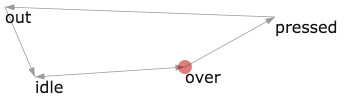

# react-f1-graph

[](http://github.com/badges/stability-badges)

A React component that visualizes [`react-f1`](http://npmjs.com/react-f1) ui.



## Usage

[](https://www.npmjs.com/package/react-f1-graph)

Example:
```javascript
var React = require('react');
var ReactDom = require('react-dom');
var ReactF1Graph = require('react-f1-graph');

ReactDom.render(
    <ReactF1Graph
        go="out"

        states={{
          out: [ 10, 10 ],
          idle: [ 40, 80 ],
          over: [ 190, 70 ],
          pressed: [ 280, 20 ]
        }},

        transitions={[
          { from: 'out', to: 'idle' },
          { from: 'idle', to: 'over', bi: true },
          { from: 'over', to: 'pressed' },
          { from: 'pressed', to: 'out' }
        ]}
    />,
    document.getElementById('container')
);
```

Props that can be passed to `ReactF1Graph`:
- `go`: Which state you'd like to animate to
- `states`: An object with x, y positions of each state represented as an Array
- `transitions`: Typical `f1` transitions
- `width`: Width of the graph
- `height`: Height of the graph
- `colorDot`: The color of the dot when rendered
- `sizeDot`: Size of the dot in pixels
- `colorLine`: The color of all lines connecting transitions
- `widthLine`: The stroke width of the line
- `colorArrow`: What colour the arrows will be
- `fontLabel`: Font family for the labels
- `colorLabel`: Color of labels

## License

MIT, see [LICENSE.md](http://github.com/mikkoh/react-f1-graph/blob/master/LICENSE.md) for details.
